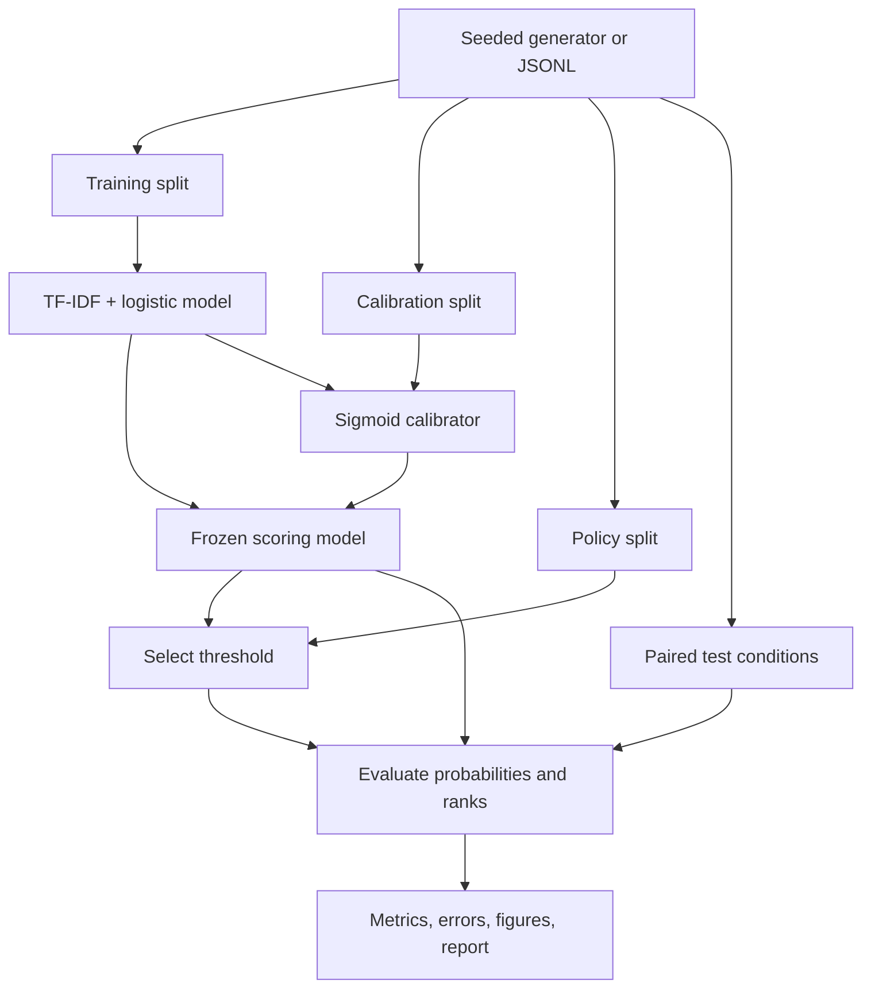

# Architecture

The test path has no connection back to fitting or threshold selection.
The exact-budget queue ranks records and takes exactly k. Frozen-threshold
alerting is evaluated separately because its queue size can change under shift.

The CPU implementation materializes each moderate-size split in memory and uses
sparse matrices. It is a reproducible research prototype, not a demonstrated
distributed pipeline. Production extensions would need streaming ingestion,
partitioned storage, model/data versioning, review feedback, and operational tests.
