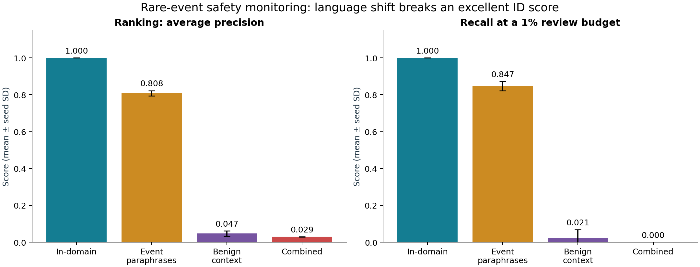

# Rare-Event Safety Classifier

**A reproducible demonstration of how excellent in-domain safety scores can fail
under shifted language, even after probability calibration.**

This CPU-only research project implements severe class imbalance, separate
calibration, exact human-review budgets and a controlled language-shift evaluation.
All data is synthetic. No API key, GPU, private telemetry or paid service is needed.



## Measured result

Five seeds, 0.5% event prevalence, 40,000 test messages per seed and condition.
The primary model is class-weighted word TF-IDF logistic regression with disjoint
sigmoid calibration. At the same **400-review budget**, it finds:

| Condition | Events found, mean / 200 | Recall @ 1% | Average precision |
| --- | --- | --- | --- |
| In-domain | 200.0 | 100.0% | 1.0000 |
| Event paraphrases only | 169.4 | 84.7% | 0.8075 |
| Benign context shift only | 4.2 | 2.1% | 0.0470 |
| Combined shift | 0.0 | 0.0% | 0.0293 |

The combined-shift result is zero detections in every seed. The fixed threshold
chosen on ID policy data instead alerts on about **8.82%** of the shifted stream,
showing why score thresholds and fixed review capacity are different policies.

**Scope:** this is a deliberately constructed lexical stress test with a small
shared template inventory. Perfect ID scores are familiar-template recognition,
not proof of semantic understanding or real-world safety. It does not benchmark
frontier models, deploy a production monitor, or demonstrate a distributed pipeline.

Read the [detailed findings](docs/REPORT.md),
[standalone illustrated HTML report](docs/Rare_Event_Safety_Report.html),
[experiment protocol](docs/EXPERIMENT_PLAN.md), [data card](docs/DATA_CARD.md),
[model card](docs/MODEL_CARD.md), and [architecture](docs/ARCHITECTURE.md).

## Run from scratch

Tested with Python **3.12.13**. Use Python 3.12 with the pinned dependencies.

```bash
python -m venv .venv
source .venv/bin/activate
python -m pip install -r requirements.txt
bash run_all.sh
```

Windows PowerShell:

```powershell
py -3.12 -m venv .venv
.venv\Scripts\Activate.ps1
python -m pip install -r requirements.txt
python -m unittest discover -s tests -v
python scripts/run_pipeline.py
python scripts/build_report.py
python scripts/audit_results.py
```

The final full experiment took about 186 seconds in the recorded environment. Your
hardware, CPU threading and numerical libraries can change runtime and floating-point
results. Configuration, actual environment and dataset hashes are recorded in
`results/manifest.json`. Timestamps are naturally different on a rerun.

Quick integration run, without overwriting published results:

```bash
python scripts/run_pipeline.py --smoke --output results/smoke
```

The smoke run is not the reported five-seed benchmark. The report builder requires
the full synthetic run. To use another output directory, invoke it explicitly with
`python scripts/build_report.py --results YOUR_RESULTS_DIRECTORY`.

## What is implemented

| Component | Implementation |
| --- | --- |
| Data generation/loading | Seeded paired text generator; validated independent JSONL splits |
| Rare events | Exactly 0.5% positives; four abstract safety categories |
| Models | Balanced word LR, unweighted word LR, balanced character LR |
| Calibration | Positive-slope sigmoid on a separate unweighted calibration split |
| Review metrics | Recall, precision, lift, TP/FP/FN at 0.1%, 0.5%, 1%, 2%, 5% capacity |
| Probability metrics | Brier, conditional Brier, log loss, ECE and reliability bins |
| Shift evaluation | Event paraphrases, benign context shift, combined shift, severity sweep |
| Uncertainty | Five seeds, seed SD, paired seed bootstrap, descriptive Wilson intervals |
| Diagnostics | Features, error examples, global-budget category slices, saved predictions |
| Reproducibility | Pinned packages, configuration, source/data hashes, unit tests and result audit |

AP is the non-interpolated average precision, not trapezoidal PR-AUC. Thresholds
are selected only on the policy split. The top-k queue always fills its exact budget
and breaks ties with a label-blind hash of the record ID. Sigmoid calibration
preserves ranking, so it cannot repair a bad review queue.

## Repository map

| Path | Purpose |
| --- | --- |
| `src/rare_event/data.py` | Generator, JSONL loader and split checks |
| `src/rare_event/model.py` | Text preprocessing, model fitting and calibration |
| `src/rare_event/metrics.py` | Budget, probability and frozen-threshold metrics |
| `scripts/run_pipeline.py` | Full experiment orchestration |
| `scripts/build_report.py` | Measured report, standalone HTML and figures |
| `scripts/audit_results.py` | Independent endpoint recomputation and provenance checks |
| `scripts/generate_data.py` | Materialize full synthetic text for one seed |
| `scripts/predict.py` | Score a message using a trusted saved model |
| `tests/test_benchmark.py` | Standard-library unittest suite |
| `configs/benchmark.json` | Frozen five-seed experiment parameters |
| `results/` | Measured tables, logs, errors and figures |
| `docs/` | Findings, protocol, cards and architecture |

## Inspect or score data

```bash
python scripts/generate_data.py --seed 17 --output data/generated
python scripts/predict.py "I will summarize the approved meeting notes for the team"
python scripts/audit_results.py
```

The prediction command loads the seed-17 model and produces a synthetic-benchmark
score. It has not been validated as a reliable real-world event probability.
Only load trusted joblib files. Full raw text is regenerated rather than committed;
small data/error samples are included in results.

For your own **independent** splits:

```bash
python scripts/run_pipeline.py --data-dir path/to/splits --output results/external
```

Supply `train.jsonl`, `calibration.jsonl`, `policy.jsonl`, `id.jsonl`, `combined.jsonl`
with unique `id`, nonempty `text`, and binary `label`; see the data card. This mode
does not claim a paired experiment or the synthetic counts and uses only one seed.
The synthetic report builder is intentionally disabled for external data.

## Output and publishing

The downloadable bundle includes seed-17 models and all 35 compressed primary-model
prediction files. These are ignored by Git by default because they can be regenerated.
Source, reports, result tables, figures and logs are ready to commit. Uploading is
pending an accessible destination repository; see `GITHUB_UPLOAD.md` for exact commands.

## Research extensions

Evaluate authorized human-labeled data with time/source holdouts; compare encoders
and costed LLM judges; introduce a separate adaptation split and untouched shift test;
measure reviewer agreement, below-threshold misses, base-rate shifts and operational
latency. These are proposed extensions, not completed claims.

Method references: [probability calibration](https://scikit-learn.org/stable/modules/calibration.html),
[average precision](https://scikit-learn.org/stable/modules/generated/sklearn.metrics.average_precision_score.html).
